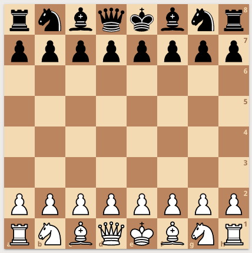
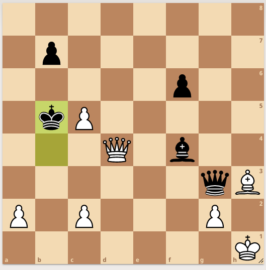
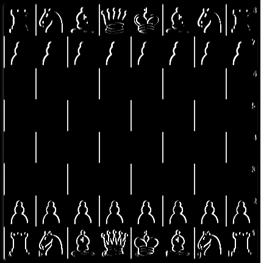
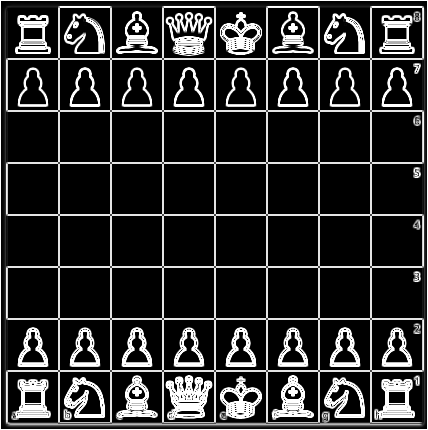
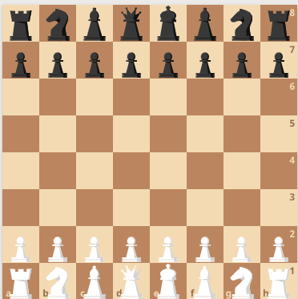

# Chessboard Recognition

This project takes images of chessboards or chess diagrams and converts them to [FEN](https://en.wikipedia.org/wiki/Forsyth%E2%80%93Edwards_Notation) strings that describe the board position of the input image.

## Examples

__Input image__

__Output FEN__

_rnbqkbnr/pppppppp/8/8/8/8/PPPPPPPP/RNBQKBNR_

We can use the lichess board editor to verify the FEN string: http://lichess.org/editor/rnbqkbnr/pppppppp/8/8/8/8/PPPPPPPP/RNBQKBNR

__Input image__

__Output FEN__

_8/1p6/5p2/1kP5/3Q1b2/6qB/P1P3P1/7K_

http://lichess.org/editor/8/1p6/5p2/1kP5/3Q1b2/6qB/P1P3P1/7K

## Implementation

Recognizing the board position in an image follows the process below:

1. Detect the boundaries of the chessboard within the image
2. Segment the chessboard image into images of each square in the board
3. Classify the piece image in each chessboard square
4. Assemble the predicted pieces from the previous step into the output FEN string

### Chessboard detection

Most convolutional neural networks apply some filters (or kernel) to an input image that serve to identify edges within the image. A manually-constructed filter for identifying vertical edges might take the form below:

    [
        [1, 0, -1],
        [1, 0, -1],
        [1, 0, -1]
    ]

Applying the filter above to the image at `img/board0.png` yields the image below:

By combining multiple such filters we can clearly identify the edges in an image of a chessboard.

To detect the chessboard in the processed image we can then identify seven evenly-spaced vertical lines and seven evenly-spaced horizontal lines that generate the grid of squares in the chessboard.

### Chess piece recognition

__Model__

I implement a TensorFlow model based on the LeNet-5 architecture to perform chess piece recognition. The LeNet-5 model was developed for handwritten digit recognition, so I thought that the model architecture might transfer well to such a similiar problem domain. The model achieves an accuracy of 100% on the training set and an accuracy over 99% on the validation set of chess piece images.

The model treats white and black pieces of each type as separate classes as well as treating the empty square as a distinct class.

__Data__

The `dataset` module generates a dataset of chess piece image from screenshots taken from the lichess.org board editor. The module derives the dataset from screenshots using different chess piece sets so that the model might generalize beyond the default piece set from lichess. I use the same [board](https://lichess.org/editor/kqrbnpkq/rbnpkqrb/npkqrbnp/kqrbnp2/KQRBNP2/NPKQRBNP/RBNPKQRB/KQRBNPKQ_w_-_-_0_1) for each screenshot since it includes multiple examples of each piece as well as empty squares. The `dataset` module uses the `board` module to segment each screenshot into images of each square on the chessboard.

I oversample the default lichess piece set by including that screenshot multiple times in the dataset.

## Limitations and future work

The approach that I use for detecting the chessboard in an image works well on images cropped closely around the edges of the board. The algorithm may fail to identify grid lines if an input image includes too much extraneous background around the board. Furthermore, chessboard detection performs poorly for some sets of chess pieces such as in the piece set shown below where the bottom edge of each piece falls close to the edge of its square:

The algorithm that I use to identify grid lines in the chessboard may perform better by using something akin to non-max suppression to identify lines in the filtered image output from convolution. Using additional convolutions and processing might also help to distinguish grid lines from the rest of the image.

Future work would focus on improving chessboard detection, but I'm also interested in refactoring the `recognition` script into a sequential TensorFlow model. I experimented with this during development in hopes of saving the processing pipeline as a SavedModel artifact compatible with TensorFlow Serving, but hit obstacles in refactoring parts of the `board` module into TensorFlow operations. The module currently depends on eager operations to identify grid lines which seems to inhibit the construction of the computational graph necessary to construct the SavedModel.

FEN strings include information on castling and en passant rules as well as which side's turn it is. It is difficult to deduce this information from only an image of the board, and this project doesn't even attempt it. The project omits any information beyond piece positioning from the output FEN string.

## Usage

To try this yourself, first install project dependencies from `requirements.txt` then run the `recognition.py` script as shown below:

    python -m chessboard_recognition.recognition --image-path <IMAGE_FILEPATH>

## References

The [TensorFlow ChessBot](https://github.com/Elucidation/tensorflow_chessbot) project solves the same task as this project. The linked repo also includes a great writeup explaining the implementation.